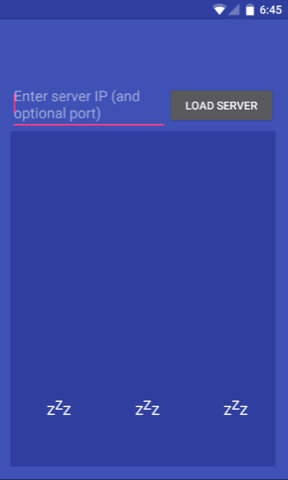
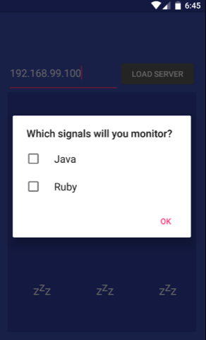
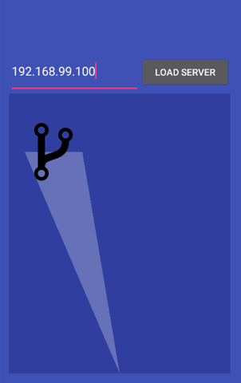

# technocrat-android
Android app which connects you to a superhero network for helping developers in distress

[Watch a 90 second explanation here](https://www.youtube.com/watch?v=32hAim6Y6K4&feature=youtu.be)

Accompanies the [technocrat-signal](https://github.com/xrd/technocrat-signal) project from the O'Reilly webcast ["Building Slackbots with Hubot in a Docker Playground"](http://www.oreilly.com/pub/e/3711)

NB: As of right now, this simulates the final step of polling and putting out the technocrat signal. The need to do the webcast trumped finalizing the code. Stay tuned..

### All is well, the city is sleeping..


### Enter the hubot status IP

```
$ docker-machine ip technocrat
192.168.99.100
```



### Choose your channels



### The Technocrat Signal! Someone needs help!




